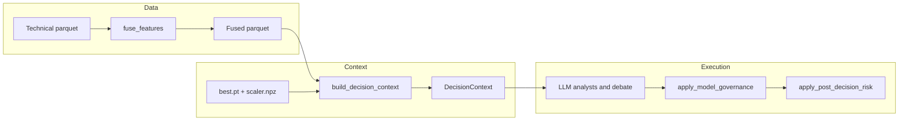

# Quant system review: root causes and remediation plan

## How the system is intended to work (actual code path)

- Fused features are built in `[astro/pipelines/fusion_pipeline.py](astro/pipelines/fusion_pipeline.py)`; news/sentiment are **optional** merges. If omitted, columns default to **0.0** (lines 29–32).
- Dev bootstrap `[scripts/bootstrap_fused_features.py](scripts/bootstrap_fused_features.py)` calls `fuse_features(...)` **without** `news_counts` or `sentiment_series`, so **all rows get zeros** for those fields—this matches your API/feature inspection.
- Decision context is built in `[astro/services/context_builder.py](astro/services/context_builder.py)`: model predictions exist only when **both** checkpoint and scaler load and `predict_latest_from_parquet` succeeds (lines 83–91).
- Final direction is set in `[astro/decision_engine/executor.py](astro/decision_engine/executor.py)` via `[astro/decision_engine/policy.py](astro/decision_engine/policy.py)` `apply_model_governance`, then portfolio clamps in `[astro/agents/risk/portfolio_constraints.py](astro/agents/risk/portfolio_constraints.py)`.

---

## Issue 1: `model_loaded: false` vs `allow_llm_only_without_model: false`

**Why it exists**

- `[astro/api/routes/system.py](astro/api/routes/system.py)` sets `model_loaded` to `**best.pt` file exists only** (line 34–39). It does **not** verify `scaler.npz`, successful `torch.load`, or schema/window compatibility.
- `[astro/api/routes/decision.py](astro/api/routes/decision.py)` passes `checkpoint` / `scaler_path` only if each file exists (lines 21–30). If either is missing, `[load_inference_optional](astro/models/transformer/inference.py)` returns `None` and `ctx.model` stays **None**.
- Governance when `model is None` does **not** raise; it returns **HOLD** if `allow_llm_only_without_model` is false (`[policy.py` lines 30–31](astro/decision_engine/policy.py)). So config is **internally consistent** for the *final signal*, but **inconsistent for operations**: you still pay for **full LLM pipelines** whose directional output is then discarded.

**What you need to do**

1. Decide **operating mode**: *strict* (fail closed: no decision without loadable model) vs *degraded* (allow narrative-only with explicit flag and audit fields).
2. Align **health** with **inference reality** (file present ≠ model usable).

**How to fix (concrete)**

- Add a **single helper** (e.g. `model_inference_status(ROOT) -> {loaded, reason, schema_id}`) used by `/system/health` and optionally by `/decision/run`:
  - Require `best.pt` **and** `scaler.npz`.
  - Optionally instantiate `TransformerInference` or run a **cheap validation** (load + `validate_model_window` on symbol’s fused parquet).
- If `allow_llm_only_without_model` is false and inference is unavailable, **short-circuit** in `[decision.py](astro/api/routes/decision.py)` or at the start of `DecisionExecutor.run` with **HTTP 503** / structured error and **no LLM spend**—this matches your suggested fail-fast behavior without changing governance math.

---

## Issue 2: `news_event_count` and `sentiment_score` always zero

**Why it exists**

- By design in `[fuse_features](astro/pipelines/fusion_pipeline.py)`: missing optional inputs → columns filled with **0.0**.
- Default dev path `[bootstrap_fused_features.py](scripts/bootstrap_fused_features.py)` never calls `[build_news_counts_parquet](astro/pipelines/news_pipeline.py)` or `[daily_sentiment_from_text_rows](astro/pipelines/sentiment_pipeline.py)`.
- `[build_decision_context](astro/services/context_builder.py)` still turns those into short strings like “Latest aggregated sentiment score: 0.0”, while analysts ask for **“comprehensive”** reports (`[sentiment_analyst.py](astro/agents/analysts/sentiment_analyst.py)`, `[news_analyst.py](astro/agents/analysts/news_analyst.py)`)—LLMs will **invent** narrative unless constrained.

**What you need to do**

Pick one or combine:

1. **Real multimodal path**: ingest news JSONL / text → daily aggregates → pass into `fuse_features` (existing hooks).
2. **Honest proxies** (your suggestion): derive **regime / volatility / return-based** features in the technical or fusion step so columns are **non-degenerate** and defensible.
3. **Explicit “no data” behavior**: do not ask the LLM to write a full report when the digest is placeholder or all-zero history.

**How to fix (concrete)**

- Extend fusion or a small **post-process** module that computes proxies (e.g. rolling return sign, ATR percentile flag as “event intensity”) and writes `sentiment_score` / `news_event_count` or **new column names** (prefer new names if semantics differ, to avoid lying in the schema).
- In analysts: if `ctx.news_summary` / `ctx.sentiment_summary` matches “no pipeline” or **all-zero tail** over N days, emit a **fixed stub report** (“No external news/sentiment in fused features; do not infer”) **or** skip the node in the executor graph.
- Document in runbooks: **bootstrap = technical-only**; production fusion must call news/sentiment builders.

---

## Issue 3: `p_up == 0.5`, `uncertainty == 1.0`

**Why it exists**

- If **no model** in context, API returns `model_output: null` (`[decision.py` lines 50–56](astro/api/routes/decision.py)); some UIs or logs may still display **defaults**—but if you see 0.5/1.0 **with** a model, causes include:
  - **Untrained / collapsed** softmax (near-uniform probabilities → max normalized entropy in `[_entropy_uncertainty](astro/models/transformer/inference.py)`).
  - **Scaler/window mismatch** handled by filling missing columns with 0.0 in `[predict_latest_from_parquet](astro/models/transformer/inference.py)` (lines 73–75), which can wash out signal.
- Training/eval quality is outside this file map but is the **dominant** real-world cause.

**What you need to do**

1. **Train** with labeled targets, verify **calibration** and **out-of-sample** metrics (Brier, AUC, baseline beats).
2. Add **runtime sanity checks** after prediction.

**How to fix (concrete)**

- After `predict_latest_from_parquet`, assert or warn when `abs(p_up - 0.5) < eps` **and** `uncertainty > threshold` **unless** explicitly in “cold start” mode—surface in API as `model_degenerate: true`.
- Add a **training/validation script gate** in CI or release checklist: checkpoint must beat naive baseline on holdout.
- Ensure **feature column order and scaler** match checkpoint (`feature_columns` in ckpt vs fused parquet)—reduce silent zero-padding.

---

## Issue 4: Agent “hallucination” (MACD narrative, P/E, macro not in context)

**Why it exists**

- Prompts **request detailed reports** with minimal grounding; only the **technical** analyst includes a strong “use ONLY” clause (`[technical_analyst.py](astro/agents/analysts/technical_analyst.py)`). **News/sentiment/fundamentals** pass short strings without forbidding outside knowledge (`[fundamentals_analyst.py](astro/agents/analysts/fundamentals_analyst.py)` even uses placeholder copy).
- LLMs **default** to general financial knowledge unless you **structurally** prevent it (JSON-only facts, tool retrieval, or refusal).

**What you need to do**

Treat analyst outputs as **conditional on evidence**: either supply evidence or forbid speculation.

**How to fix (concrete)**

- Add a shared **prompt prefix**: “You may only state facts numerically present in DATA. If a metric is not listed, write ‘Not in fused features.’ No P/E, macro, or events unless explicitly in DATA.”
- Stronger: require **structured output** (Pydantic / JSON) with fields mirroring allowed columns from the last row or tail stats, then render narrative **from that JSON only** in a second step—or skip narrative for production signals.
- Wire **fundamentals** from a real source or keep the node disabled in `[agents.yaml](astro/configs/agents.yaml)` until data exists.

---

## Issue 5: Decision layer “HOLD by accident”

**Why it exists**

- With `model None` or `|p_up - 0.5| < min_edge_for_directional` (0.08 in `[agents.yaml](astro/configs/agents.yaml)`), governance returns **HOLD** (`[policy.py` lines 33–35](astro/decision_engine/policy.py)). That is **correct policy** given weak signal—but **opaque** if clients do not see *why* (no model vs edge vs uncertainty).

**What you need to do**

Expose **decision provenance** in API responses and logs: `governance_reason`, `model_present`, `edge`, `raw_llm_signal`.

**How to fix (concrete)**

- Extend decision response (and JSON decision logs under `data/cache/decision_logs/`) with a small **dict** returned from a refactored `apply_model_governance` (e.g. return `(signal, meta)`).

---

## Issue 6: Risk layer stubs (`atr=0.02`, `price=100.0`)

**Why it exists**

- Hardcoded in `[DecisionExecutor.run](astro/decision_engine/executor.py)` (lines 368–369) when calling `apply_post_decision_risk` (`[portfolio_constraints.py](astro/agents/risk/portfolio_constraints.py)`).

**What you need to do**

Drive sizing from **the same fused frame** (last close, ATR column if present) and **actual positions** from `[ExposureManager](astro/agents/risk/exposure_manager.py)` / IBKR when available.

**How to fix (concrete)**

- Pass `price` from last row `close`/`Close` in context builder or executor.
- Pass `atr` from technical columns if present; else from config default with explicit flag `sizing_vol_proxy: config_default`.
- Optionally refresh positions from IBKR before `clamp_signal_for_portfolio` (already have `[IBKRClient](astro/ingestion/ibkr/client.py)` patterns in health).

---

## Issue 7: Postman / API “stub” risk endpoints

**Why it exists**

- Collection documents manual stub bodies (`[postman/Astro_Trading_API.postman_collection.json](postman/Astro_Trading_API.postman_collection.json)`); unrelated to production fused path but encourages **testing with fake reports**.

**What you need to do**

Use **end-to-end** `/decision/run` for integration tests; reserve stub routes for unit tests only.

---

## Suggested implementation order (impact vs effort)

1. **Governance + health alignment + fail-fast (or explicit degraded mode)** — stops silent “expensive HOLD” and fixes the worst ops inconsistency.
2. **Model training + degenerate-output checks** — restores the quant core.
3. **Fusion: real news/sentiment or documented proxies + analyst gating** — fixes dead multimodal columns and narrative hallucination risk.
4. **Risk sizing from real price/vol + portfolio** — makes sizing and caps meaningful.
5. **Provenance fields in API/logs** — auditability for a “serious system.”

This sequence matches your scorecard: architecture and API are already strong; the gap is **signal integrity, enforcement, and observability**.