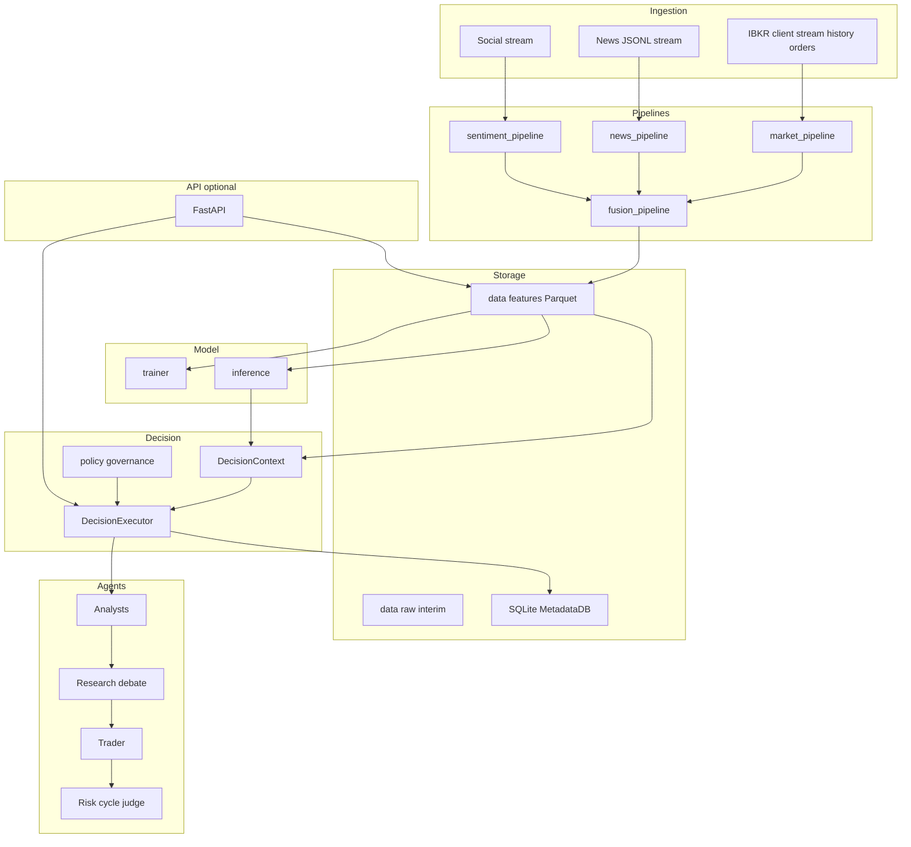

# Project Astro – Technical Overview

This document describes the **Astro** package inside the TradingAgents repository: architecture, data and decision flows, configuration, runtime setup, HTTP API usage (including Postman), and manual testing.

**Package name (PyPI / install):** `astro-trading`  
**Python import root:** `astro` (package code under `astro/astro/` inside this project directory)  
**Project layout:** this **folder** is self-contained: `pyproject.toml`, `scripts/`, `tests/`, `postman/`, `requirements*.txt`, and the installable package subtree `astro/` (configs, api, agents, …).

---

## 1. High-level design (HLD)

### 1.1 Purpose

Astro is a **modular, IBKR-oriented trading intelligence stack** that separates:

- **Data ingestion** (market, news, sentiment) from **agents**
- **Feature engineering** and **schema validation** from **LLM reasoning**
- A **transformer** as a first-class numeric signal, with **policy** so the model can govern final BUY/SELL/HOLD when configured
- A **decision engine** that replaces LangGraph with explicit Python control flow
- Optional **FastAPI** control plane for UI, ops, and integration tests

### 1.2 Layered architecture



### 1.3 Design principles

| Principle | Implementation |
|-----------|----------------|
| Data/agents decoupling | Analysts read [`DecisionContext`](astro/decision_engine/state_manager.py) built from Parquet + optional model output, not live yfinance tools inside the graph |
| Train/live/backtest parity | [`FeatureService`](astro/services/feature_service.py) loads fused Parquet; same paths used by scripts and API where applicable |
| Schema safety | [`features/schema_registry.json`](astro/features/schema_registry.json) + [`features/validation.py`](astro/features/validation.py); trainer and inference validate columns |
| Model governance | [`decision_engine/policy.py`](astro/decision_engine/policy.py) + `model_governance` in [`configs/agents.yaml`](astro/configs/agents.yaml) |
| Latency modes | `fast` vs `full` in [`DecisionExecutor.run`](astro/decision_engine/executor.py); uncertainty can upgrade fast to full |

---

## 2. Low-level design (LLD)

### 2.1 Directory map (granular)

| Path | Responsibility |
|------|----------------|
| [`astro/configs/`](astro/configs/) | YAML: system, agents, model, risk, ibkr |
| [`astro/ingestion/`](astro/ingestion/) | IBKR client/historical/stream/orders; news/sentiment streams; [`scheduler.py`](astro/ingestion/scheduler.py); [`STREAMING.md`](astro/ingestion/STREAMING.md) |
| [`astro/pipelines/`](astro/pipelines/) | market, news, sentiment, fusion Parquet outputs |
| [`astro/features/`](astro/features/) | technical indicators/volatility; fundamental stubs; sentiment/news helpers; **schema registry + validation** |
| [`astro/models/transformer/`](astro/models/transformer/) | architecture, dataset, trainer, inference |
| [`astro/models/ensemble/`](astro/models/ensemble/) | aggregator stub |
| [`astro/agents/`](astro/agents/) | analysts, researchers, trader, risk debators + judge, shared memory |
| [`astro/decision_engine/`](astro/decision_engine/) | state, routing, workflow helpers, **policy**, **executor** |
| [`astro/services/`](astro/services/) | **feature_service**, **context_builder** |
| [`astro/storage/`](astro/storage/) | SQLite metadata, positions, experiments, decisions; optional vector store |
| [`astro/execution/`](astro/execution/) | trade executor, order manager (idempotency), slippage |
| [`astro/backtesting/`](astro/backtesting/) | engine, simulator, metrics |
| [`astro/monitoring/`](astro/monitoring/) | logs/metrics/alerts placeholders, dashboard stub |
| [`astro/utils/`](astro/utils/) | config_loader, logger, time, constants, **llm/** factory |
| [`astro/api/`](astro/api/) | FastAPI app, routes, schemas, dependencies |

Repo-level: `scripts/` (run_live, run_backtest, train_model, run_decision, run_api), `data/` (raw, interim, features, cache, backtest), `tests/`.

### 2.2 Core types

- **`DecisionContext`** ([`state_manager.py`](astro/decision_engine/state_manager.py)): symbol, as_of, text summaries (market/sentiment/news/fundamentals), `feature_version`, `bar_timestamp`, optional **`ModelPrediction`** (`p_up`, `uncertainty`, …), **`extra`** (schema ids, paths, validation flags).
- **`AstroState`**: reports, debate dicts, `investment_plan`, `trader_investment_plan`, `final_trade_decision`, embedded `context`.
- **`MetadataDB`** ([`storage/database.py`](astro/storage/database.py)): decisions, orders, positions, experiments, manifests.

### 2.3 Decision executor (control flow)

**Entry:** [`DecisionExecutor.run(symbol, trade_date, context, mode=...)`](astro/decision_engine/executor.py)

1. Resolve **effective mode**: if user asked `fast` but model **uncertainty** exceeds `uncertainty_debate_threshold` in [`agents.yaml`](astro/configs/agents.yaml), upgrade to `full`.
2. **Full pipeline:** all `selected_analysts` → optional **skip bull/bear** when model uncertainty is very low (`skip_debate_if_certain`) → research synthesizer → trader → 3-way risk debators → risk judge.
3. **Fast pipeline:** `fast_mode_analysts` only → synthetic `investment_plan` → trader → **single** risk judge (no 3-way loop).
4. Parse LLM narrative with [`signal_generator.extract_signal_from_text`](astro/agents/trader/signal_generator.py).
5. Apply **`apply_model_governance`** ([`policy.py`](astro/decision_engine/policy.py)) using `model_governance` config.
6. Apply **portfolio constraints** via [`ExposureManager`](astro/agents/risk/exposure_manager.py) + [`apply_post_decision_risk`](astro/agents/risk/portfolio_constraints.py) (SQLite positions under `data/cache/astro_meta.sqlite`).
7. Write JSON decision log under `data/cache/decision_logs/` (includes `schema_id`, checkpoint hash, `suggested_size_usd`, etc.).

**Routing parity with legacy LangGraph:** [`routing.py`](astro/decision_engine/routing.py) (`should_continue_debate`, `should_continue_risk_analysis`).

### 2.4 Transformer pipeline (LLD)

- **Train:** [`trainer.train`](astro/models/transformer/trainer.py) validates fused frame → fits scaler → saves `best.pt` with `schema_id`, `feature_schema_version`, `feature_columns`, `model_cfg`.
- **Infer:** [`TransformerInference`](astro/models/transformer/inference.py) loads checkpoint + scaler; validates model columns on DataFrame; **uncertainty** from softmax entropy.
- **Dataset:** [`dataset.py`](astro/models/transformer/dataset.py) – time-ordered windows, labels from forward returns, train/val split indices excluding invalid tails.

### 2.5 Feature schema

- Registry: [`features/schema_registry.json`](astro/features/schema_registry.json) – `default_schema_id`, per-schema `required_columns`.
- Fusion ensures missing required columns are filled (e.g. zeros) before write; manifests carry `schema_id`.

---

## 3. End-to-end flows (granular)

### 3.1 Offline: synthetic → features → fuse → (optional) train

1. Produce CSV OHLCV (or IBKR historical → CSV) under `data/raw/market/` or use [`synthetic_ohlcv_csv`](astro/ingestion/ibkr/historical_fetch.py).
2. [`csv_to_interim_ohlcv`](astro/ingestion/ibkr/historical_fetch.py) → `data/interim/`.
3. [`MarketPipeline.run`](astro/pipelines/market_pipeline.py) → `data/features/{SYMBOL}_features.parquet` + manifest.
4. [`fuse_features`](astro/pipelines/fusion_pipeline.py) → `data/features/{SYMBOL}_fused.parquet`.
5. `python scripts/train_model.py --fused data/features/SYMBOL_fused.parquet` → `models/checkpoints/best.pt` + `scaler.npz`.

### 3.2 Decision run (script)

```text
python scripts/run_decision.py --symbol SPY --date 2024-06-01 [--mode fast|full]
```

Loads config, builds context via [`build_decision_context`](astro/services/context_builder.py), runs `DecisionExecutor.run`, logs SQLite decision row.

### 3.3 Live ingestion (stub)

[`scripts/run_live.py`](scripts/run_live.py) + [`IngestionScheduler`](astro/ingestion/scheduler.py): requires `ib_async`, TWS/Gateway; optional `util.patchAsyncio()`.

### 3.4 API request flow

```text
Client → FastAPI route → (FeatureService / MetadataDB / DecisionExecutor) → JSON
```

Decision route additionally **inserts** a row into `decisions` for replay by `decision_id`.

---

## 4. Configuration reference

All YAML lives under [`astro/configs/`](astro/configs/). Loaded by [`utils/config_loader.py`](astro/utils/config_loader.py) (`load_all_configs()`). Paths like `data_root` are relative to **current working directory** unless absolute.

### 4.1 [`system.yaml`](astro/configs/system.yaml)

| Key | Meaning |
|-----|---------|
| `timezone` | Default TZ for scheduling/display |
| `default_timeframe` | e.g. `1d` |
| `decision_debounce_seconds` | Cooldown hint for live loops |
| `max_llm_rounds_fast` | Latency hint for fast mode |
| `log_level` | e.g. INFO |
| `data_root` | Root folder for `data/` tree |
| `feature_schema_version` | Logical version string |

### 4.2 [`agents.yaml`](astro/configs/agents.yaml)

| Key | Meaning |
|-----|---------|
| `selected_analysts` | Order: `market`, `social`, `news`, `fundamentals` |
| `fast_mode_analysts` | Subset for fast path |
| `max_debate_rounds` / `max_risk_discuss_rounds` | Match legacy LangGraph semantics |
| `decision_mode_default` | `fast` or `full` when API/script omits mode |
| `quick_think` / `deep_think` | LLM provider, model, temperature |
| `model_governance` | `enabled`, `min_edge_for_directional`, `allow_llm_only_without_model`, `agents_can_override_direction` |
| `uncertainty_debate_threshold` | Upgrade fast→full when model uncertainty high |
| `skip_debate_if_certain` / `uncertainty_certainty_max` | Skip bull/bear when model very certain |

### 4.3 [`model.yaml`](astro/configs/model.yaml)

| Key | Meaning |
|-----|---------|
| `schema_id` | Must align with [`schema_registry.json`](astro/features/schema_registry.json) |
| `seq_len`, `timeframe`, `feature_columns` | Transformer I/O |
| `d_model`, `n_heads`, `n_layers`, `dropout` | Architecture |
| `forward_horizon_bars`, `label` | Supervision |
| `batch_size`, `learning_rate`, `epochs` | Training |
| `checkpoint_dir`, `scaler_path` | Relative to repo cwd typically |

### 4.4 [`risk.yaml`](astro/configs/risk.yaml)

| Key | Meaning |
|-----|---------|
| `max_position_fraction` | Cap per trade vs NAV |
| `max_daily_loss_fraction` | Policy placeholder |
| `max_concentration` | Concentration guard |
| `max_gross_exposure_fraction` | Blocks new BUY when book too full vs NAV |
| `default_slippage_bps` | Backtest/sim |
| `portfolio_nav` | Denominator for exposure fraction |

### 4.5 [`ibkr.yaml`](astro/configs/ibkr.yaml)

| Key | Meaning |
|-----|---------|
| `host`, `port`, `client_id` | TWS/Gateway (paper often 7497) |
| `paper`, `read_only` | Safety flags |

### 4.6 Environment variables (typical)

Copy [`.env.example`](.env.example) in this project folder to `.env` and load with `python-dotenv` where scripts support it.

| Variable | Used for |
|----------|----------|
| `OPENAI_API_KEY` | Default LLM for OpenAI-compatible stack |
| `ANTHROPIC_API_KEY`, `GOOGLE_API_KEY`, etc. | Other providers in `utils/llm` |
| `ASTRO_API_KEY` | If set, `POST /api/v1/execution/order` requires header `X-API-Key` |
| `ASTRO_SKIP_IBKR_CONNECT` | If `1` / `true`, API **does not** connect to IBKR on startup |
| `ASTRO_HEALTH_CHECK_IBKR=1` | One-off IBKR probe on `/health` when no shared startup client exists |
| IBKR-related | As needed for full auth (see comments in `ibkr.yaml`) |

On API startup, Astro **attempts a persistent IBKR connection** (see [`api/lifecycle.py`](astro/api/lifecycle.py)): `GET /api/v1/system/health` reports `ibkr_connected` from that session and `ibkr_connect_error` if connect failed or `ib_async` is missing. `POST /api/v1/execution/order` reuses the same client when present.

---

## 5. How to run the project

### 5.1 Prerequisites

- Python **3.10+**
- Work from **this directory** (the Astro project root—the folder that contains `pyproject.toml`).

### 5.2 Install

**Editable install (recommended):**

```bash
cd /path/to/astro   # this folder (e.g. TradingAgents-main/astro in a monorepo)
pip install -e .
# Optional stacks:
pip install -e ".[ibkr]"    # IBKR (ib_async)
pip install -e ".[train]"   # PyTorch training
pip install -e ".[api]"     # FastAPI + uvicorn
pip install -e ".[dev]"     # pytest + API stack for tests
```

**Standalone dependency list:** use [`requirements.txt`](requirements.txt) (core + API + IBKR + `python-dotenv`) and optionally [`requirements-train.txt`](requirements-train.txt) for PyTorch. After `pip install -r requirements.txt`, run `pip install -e .` from this same directory so the `astro` package is importable.

`scripts/run_api.py` loads `.env` from **this project directory** so `OPENAI_API_KEY` and keys apply automatically.

### 5.3 Prepare data layout

Ensure directories exist (repo may ship `.gitkeep` under `data/`):

- `data/raw/market`, `data/interim`, `data/features`, `data/cache`, etc.

Place **fused** Parquet at:

`data/features/{SYMBOL}_fused.parquet`

for decision runs and API that resolve paths from config.

### 5.4 Scripts (non-CLI entrypoints)

| Script | Command | Notes |
|--------|---------|--------|
| Train | `python scripts/train_model.py --fused path/to/fused.parquet` | Needs `[train]` |
| Backtest | `python scripts/run_backtest.py --fused path/to/fused.parquet [--symbol TEST]` | Validates schema via FeatureService |
| Decision | `python scripts/run_decision.py --symbol SPY --date 2024-06-01 [--mode fast\|full]` | Needs LLM keys |
| Live | `python scripts/run_live.py --symbol SPY` | Needs IBKR + `[ibkr]` |
| **API** | `python scripts/run_api.py` | Default `0.0.0.0:8000` |

Alternative API launch:

```bash
uvicorn astro.api.app:app --host 0.0.0.0 --port 8000 --reload
```

### 5.5 Automated tests

```bash
cd /path/to/astro
pip install -e ".[dev]"
python -m pytest tests/ -v
```

---

## 6. HTTP API – design and Postman setup

**OpenAPI docs (when server is running):**

- Swagger UI: `http://localhost:8000/docs`
- ReDoc: `http://localhost:8000/redoc`

**Base URL for Postman:** `http://localhost:8000`

**Importable collection (ordered flow + descriptions):** [`postman/Astro_Trading_API.postman_collection.json`](postman/Astro_Trading_API.postman_collection.json) — Postman → Import → select that file; set collection variables (`baseUrl`, `symbol`, `tradeDate`, `apiKey`, etc.).

Create a Postman **Environment** with (if not using only collection variables):

- `base_url` = `http://localhost:8000`
- `api_key` = (optional) matches `ASTRO_API_KEY` if you set it

### 6.1 System

| Method | URL | Body | Headers |
|--------|-----|------|---------|
| GET | `{{base_url}}/api/v1/system/health` | none | optional |
| GET | `{{base_url}}/api/v1/system/config` | none | optional |

**Note:** `ibkr_connected` is only probed when `ASTRO_HEALTH_CHECK_IBKR=1`.

### 6.2 Data

| Method | URL | Query |
|--------|-----|--------|
| GET | `{{base_url}}/api/v1/data/features` | `symbol=SPY`, `timeframe=1d` |
| GET | `{{base_url}}/api/v1/data/market` | `symbol=SPY` |

Requires `data/features/{symbol}_fused.parquet` (resolved via `data_root`).

### 6.3 Model

| Method | URL | Body (JSON) |
|--------|-----|----------------|
| POST | `{{base_url}}/api/v1/model/predict` | `{"symbol": "SPY"}` |

Requires `models/checkpoints/best.pt` and `scaler.npz` at repo-relative paths used in route.

### 6.4 Agents

| Method | URL | Body (JSON) |
|--------|-----|-------------|
| POST | `{{base_url}}/api/v1/agents/analysts` | `{"symbol": "SPY", "trade_date": "2024-06-01"}` |
| POST | `{{base_url}}/api/v1/agents/research` | same |
| POST | `{{base_url}}/api/v1/agents/risk` | See below |

**Risk body example:**

```json
{
  "company_of_interest": "SPY",
  "trade_date": "2024-06-01",
  "market_report": "...",
  "sentiment_report": "...",
  "news_report": "...",
  "fundamentals_report": "...",
  "investment_plan": "...",
  "trader_investment_plan": "...",
  "astro_context": {"symbol": "SPY", "as_of": "2024-06-01"}
}
```

### 6.5 Decision (full stack, LLM-heavy)

| Method | URL | Body (JSON) |
|--------|-----|-------------|
| POST | `{{base_url}}/api/v1/decision/run` | `{"symbol": "SPY", "trade_date": "2024-06-01", "mode": "full"}` |

`mode` optional: omit to use `decision_mode_default` from YAML.

Response includes `decision_id` for replay, analyst/research/risk snippets, schema validation flags.

### 6.6 Backtest

| Method | URL | Body (JSON) |
|--------|-----|-------------|
| POST | `{{base_url}}/api/v1/backtest/run` | `{"fused_path": "data/features/TEST_fused.parquet", "signal_col": "sentiment_score", "symbol": "TEST"}` |

`fused_path` can be relative to repo root.

### 6.7 Execution (IBKR)

| Method | URL | Body | Headers |
|--------|-----|------|---------|
| POST | `{{base_url}}/api/v1/execution/order` | see below | `X-API-Key: {{api_key}}` **if** `ASTRO_API_KEY` is set |

```json
{
  "symbol": "SPY",
  "action": "BUY",
  "quantity": 1,
  "idempotency_key": "order-20240601-001"
}
```

Requires paper/live TWS, `[ibkr]`, and `ibkr.paper: true` enforced for safety in route logic.

### 6.8 Replay

| Method | URL | Query |
|--------|-----|--------|
| GET | `{{base_url}}/api/v1/replay` | `decision_id=1` **or** `log_file=decision_SPY_2024-06-01.json` |
| | | `recompute=true` → currently returns 501 |

### 6.9 Experiments

| Method | URL | Body (JSON) |
|--------|-----|-------------|
| POST | `{{base_url}}/api/v1/experiments/log` | `{"model_version": "v1", "schema_id": "fused_v1", "payload": {"note": "trial"}}` |

### 6.10 WebSocket

- URL: `ws://localhost:8000/ws/stream`
- Postman: New → WebSocket Request → connect to above; server sends periodic JSON heartbeat.

### 6.11 Postman collection (manual build checklist)

1. Create Collection **Astro API**.
2. Add environment **Local** with `base_url`, optional `api_key`.
3. Duplicate folders: System, Data, Model, Agents, Decision, Backtest, Execution, Replay, Experiments.
4. For each POST above, set **Body → raw → JSON** and **Content-Type: application/json** (Postman sets this automatically for raw JSON).
5. On Execution folder, add header `X-API-Key` when using API key auth.
6. Save responses to validate `decision_id`, `sharpe`, etc.

---

## 7. Manual testing matrix (without Postman)

### 7.1 curl examples

```bash
curl -s http://localhost:8000/api/v1/system/health
curl -s http://localhost:8000/api/v1/system/config
curl -s "http://localhost:8000/api/v1/data/features?symbol=SPY&timeframe=1d"
curl -s -X POST http://localhost:8000/api/v1/model/predict -H "Content-Type: application/json" -d "{\"symbol\":\"SPY\"}"
curl -s -X POST http://localhost:8000/api/v1/decision/run -H "Content-Type: application/json" -d "{\"symbol\":\"SPY\",\"trade_date\":\"2024-06-01\",\"mode\":\"fast\"}"
```

### 7.2 pytest

- Unit: `tests/unit/test_routing.py`, `test_policy.py`, `test_validation.py`, `test_signal_generator.py`
- Integration: `tests/integration/test_pipeline_offline.py`
- API smoke: `tests/test_api.py` (requires FastAPI in env)

---

## 8. Troubleshooting

| Symptom | Check |
|---------|--------|
| 404 on data routes | `data_root` cwd; fused file path `data/features/{symbol}_fused.parquet` |
| 503 on model predict | `models/checkpoints/best.pt` and `scaler.npz` exist |
| Schema validation errors | Columns vs [`schema_registry.json`](astro/features/schema_registry.json); re-run fusion |
| LLM errors | API keys, `agents.yaml` provider/model names |
| IBKR errors | Gateway running, port, `pip install -e ".[ibkr]"` |
| Execution 401 | Header `X-API-Key` matches `ASTRO_API_KEY` |

---

## 9. Related docs

- Kafka / async scaling notes: [`ingestion/STREAMING.md`](astro/ingestion/STREAMING.md)
- Legacy TradingAgents architecture: repository root `README.md`

---

*Document version: aligned with Astro package layout and API as of the `astro-trading` 0.1.x tree. For exact line behavior, refer to source files cited above.*
