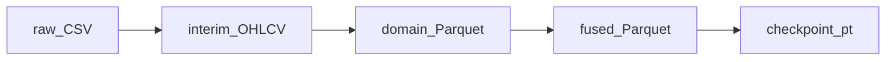
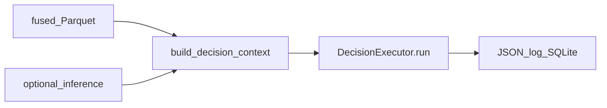

# Data flow

This page ties **offline** machine-learning workflows to **online** decision and API paths. Use it when you need to answer: *where does data live, who reads it, and what breaks if a file is missing?*

## Offline: raw data to trained model

### Why this path exists

You cannot trust a transformer—or LLM prompts that reference indicators—if **training rows** and **inference rows** come from different code paths. Astro standardizes on **fused Parquet** as the handshake between **pipelines**, **trainer**, and **inference**.

### Step-by-step (with failure modes)

| Step | Action | Output | Typical failure |
|------|--------|--------|-----------------|
| 1 | Obtain OHLCV (CSV, IBKR historical, synthetic) | Raw under `data/raw` or similar | Wrong timezone or symbol format → bad joins later |
| 2 | Normalize to interim (`csv_to_interim_ohlcv` in `historical_fetch.py`) | `data/interim/` | Missing columns → pipeline exceptions |
| 3 | `MarketPipeline.run` | `{SYMBOL}_features.parquet` + manifest | Indicator NaNs if insufficient history |
| 4 | News/sentiment pipelines | Additional feature files | Parser drift → empty modalities |
| 5 | `fuse_features` in `fusion_pipeline.py` | `{SYMBOL}_fused.parquet` | Schema mismatch vs registry → validation errors at train/API |
| 6 | `scripts/train_model.py --fused ...` | `best.pt`, `scaler.npz` | CUDA/CPU, or missing `[train]` extra |

Training validates columns against **schema registry** and `model.yaml` (`trainer.py`). If validation fails, fix **upstream fusion**, not the model file.

## Decision execution narrative

### End-to-end story (script or API)

Whether you call `scripts/run_decision.py` or `POST /api/v1/decision/run`, the **logical** story is the same:

1. **Locate fused features** — `{data_root}/features/{symbol}_fused.parquet`. If missing, some routes **404** early; the decision route may still proceed with a thinner context depending on code path—**do not rely on accidental lenience**; keep files present.
2. **Build context** — `build_decision_context` loads the tail of the frame, creates **text summaries** for each modality, extracts **structured numeric facts** for audit (`structured_market_facts`), and runs **optional inference** if checkpoint/scaler exist.
3. **Validate schema** — Results are stored in `context.extra` (`schema_validation_ok`, `schema_validation_errors`). The API surfaces this so operators can detect drift **before** trusting `decision_id`.
4. **Governance gate (HTTP only for strict)** — `resolve_governance_mode` + `model_missing_would_violate_governance` may return **503** before any LLM spend.
5. **Executor** — `DecisionExecutor.run` chooses **fast** or **full** (possibly upgraded), runs **analysts → research (optional) → trader → risk**. **LLM stages are always entered through the executor** (or its `run_*_only` helpers used by partial API routes), not as independent parallel services.
6. **Signal, governance, portfolio (inside `run`)** — After agents finish, the same `run` method calls `extract_signal_from_text`, then `apply_model_governance_detailed`, then `apply_post_decision_risk` against SQLite—**not** separate HTTP handlers chained after the fact.
7. **Persistence** — JSON log under `decision_logs/` (if `log_dir` configured on executor) and SQLite **`insert_decision`** on the API route.

### What can fail at each step

| Stage | Symptom | Likely cause |
|-------|---------|--------------|
| Context | Empty summaries | Missing columns or all-NaN tail |
| Inference | `model_predict_error` in `extra` | Checkpoint/scaler mismatch, wrong `seq_len` |
| Governance | **503** `model_required` | Strict mode + no `ModelPrediction` |
| Agents | Timeout / 5xx from provider | LLM keys, rate limits, huge prompts |
| Portfolio | `suggested_size_usd` zeroed | Exposure limits, stale positions, sizing inputs default |

## API read paths (data plane)

| Client intent | Endpoint | Internal call chain |
|---------------|----------|---------------------|
| “Do we have features?” | `GET /api/v1/data/features` | `FeatureService.latest_feature_row` |
| “Show me recent bars” | `GET /api/v1/data/market` | `load_fused` → tail 20 |
| “Score without LLMs” | `POST /api/v1/model/predict` | `load_inference_optional` → `predict_latest_from_parquet` |
| “Full decision” | `POST /api/v1/decision/run` | context + executor + `MetadataDB` |

## WebSocket stream

`WS /ws/stream` emits a **heartbeat** every five seconds. It does **not** stream quotes or decisions today—treat it as a **connectivity stub** unless you extend `stream.py`.

See also [Sequence diagrams](sequence_diagrams.md) for HTTP timing and branching.
