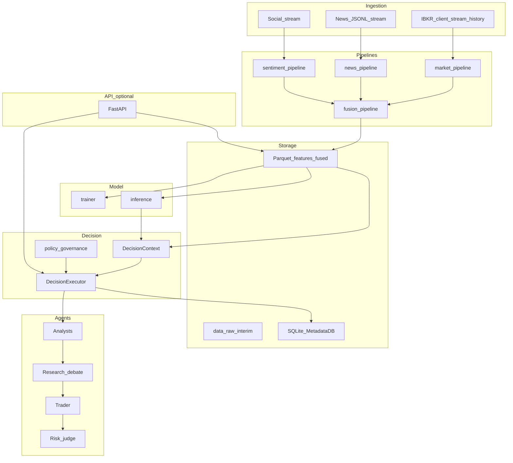

# High-level design (HLD)

## Why this architecture exists

Trading systems that mix **data fetch**, **feature code**, and **LLM prompts** in one undifferentiated layer become impossible to regression-test and dangerous to operate: you cannot tell whether a bad signal came from **stale data**, **schema drift**, **model failure**, or **prompt variance**. Astro separates concerns so that each phase has **clear inputs, outputs, and failure modes**:

- **Ingestion and pipelines** produce **immutable-ish artifacts** (Parquet) you can diff, version, and replay.
- **Features and validation** enforce **contracts** before any expensive LLM or GPU work.
- **Models** contribute **numeric** beliefs (`p_up`, uncertainty) that **governance** can require or blend with LLM output.
- **Agents** focus on **narrative synthesis** over a fixed **`DecisionContext`**, not on ad-hoc data plumbing.
- **The API** is an optional **control plane**—the same executor runs from scripts without HTTP.
- **Broker orders** are **not** emitted automatically after `POST /api/v1/decision/run`; a client must call `POST /api/v1/execution/order` separately (paper-gated, idempotent).

The diagram below is not decorative: each box is a **replaceable subsystem**. Swapping IBKR for another broker would hurt **ingestion/execution** first; swapping the transformer leaves **agents** intact as long as **`ModelPrediction`** shape is preserved.

## System components (what, why, how they connect)

| Component | What it does | Why it exists | Connects to |
|-----------|--------------|---------------|-------------|
| **Ingestion** | Pulls or receives market, news, sentiment streams; IBKR connect helpers | Without acquisition, everything downstream is fiction | **Pipelines** (raw/interim inputs) |
| **Pipelines** | Deterministic transforms → domain Parquet → **fusion** | Keeps ETL **out** of LLM code | **Features** store, **FeatureService** readers |
| **Features** | Indicators, helpers, **schema registry**, validation | Prevents silent column mismatch at train and inference | **Models**, **context_builder** |
| **Models** | Transformer train/infer; optional ensemble stub | Quant signal separate from language | **DecisionContext.model**, `/model/predict` |
| **Agents** | Analysts, debate, trader, risk | Human-auditable reasoning on top of numbers | **Invoked by DecisionExecutor** (also exposed via partial API routes that delegate to the same executor) |
| **Decision engine** | State, routing, **policy**, **executor** | Single place for **fast/full**, governance, logging | **Storage**, **Services** |
| **Services** | `FeatureService`, `build_decision_context`, readiness | DRY path resolution and context assembly | **API** routes, scripts |
| **Storage** | SQLite for decisions, orders, positions, experiments | Operational memory without a separate DB server for small deployments | **Execution**, **replay**, **decision** route |
| **Execution** | Broker orders, idempotency, slippage helpers | Last mile, intentionally **gated** | **IBKR client**, **MetadataDB** |
| **Backtesting** | Signal PnL metrics | Validate pipelines before capital | **FeatureService**-loaded frames |
| **API** | FastAPI + lifespan IBKR | Integration and ops without importing scripts | **All of the above** |

## Architecture diagram

## Technology stack

| Layer | Technology | Notes |
|-------|------------|-------|
| Runtime | Python **≥ 3.10** | `pyproject.toml` |
| Data | **pandas**, **numpy**, **pyarrow** | Parquet I/O |
| Config | **PyYAML** | `astro/configs/*.yaml` |
| LLM | **langchain-openai** (+ factory for other providers) | `astro/utils/llm/` |
| HTTP API | **FastAPI**, **uvicorn** | Optional extra `[api]` / `[dev]` |
| Broker | **ib_async** | Optional extra `[ibkr]` |
| Training | **PyTorch** | Optional extra `[train]` |
| Persistence | **SQLite** | `astro_meta.sqlite` under `data_root/cache/` |

## Scaling strategy

| Dimension | Approach | Caveat |
|-----------|----------|--------|
| **API replicas** | Stateless route handlers; shared **`AstroConfig`** via `lru_cache` | Each replica needs **shared** `data_root` and model checkpoints **or** external artifact store—not bundled. |
| **IBKR** | One async-connected client on lifespan (`app.state.ibkr_client`) | Not horizontally partitioned in-repo; multi-user broker access needs external design. |
| **LLM calls** | Bound by provider quotas and sequential agent chains | `fast` mode reduces fan-out. |

## Fault tolerance and degradation

| Mechanism | Behavior |
|-----------|----------|
| IBKR startup failure | API still starts; `ibkr_connect_error` on `app.state`; health exposes error string (`api/lifecycle.py`). |
| Skip IBKR connect | `ASTRO_SKIP_IBKR_CONNECT=1` |
| Model missing at decision | **strict** governance → **503** `model_required` on `POST /api/v1/decision/run`; **degraded** / **dev** allow run with response flags (`governance_mode.py`, `decision.py`). |
| Fused file missing | Data routes **404**; predict **404**; context may be thinner but some routes still attempt work—see [API endpoints](../api/endpoints.md). |

## Data lifecycle (narrative)

1. **Raw / interim** — Human or IBKR-driven CSV lands under `data/raw` or `data/interim`. This is the **only** place unstructured mess is allowed.
2. **Per-domain features** — Pipelines write typed Parquet (e.g. `{SYMBOL}_features.parquet`) so you can inspect **one modality** in isolation.
3. **Fused** — Fusion aligns modalities into **`{SYMBOL}_fused.parquet`**, the **contract surface** for the model and `DecisionContext` text summaries.
4. **Model artifacts** — Training emits **`best.pt`** + **`scaler.npz`** under `models/checkpoints/` (API resolves via **`ROOT`**, not `data_root`).
5. **Operational metadata** — Each decision can insert a row in SQLite and a JSON file under `decision_logs/` for **audit** and **replay**.

See [Data flow](data_flow.md) for step-by-step decision plumbing and failure points.
