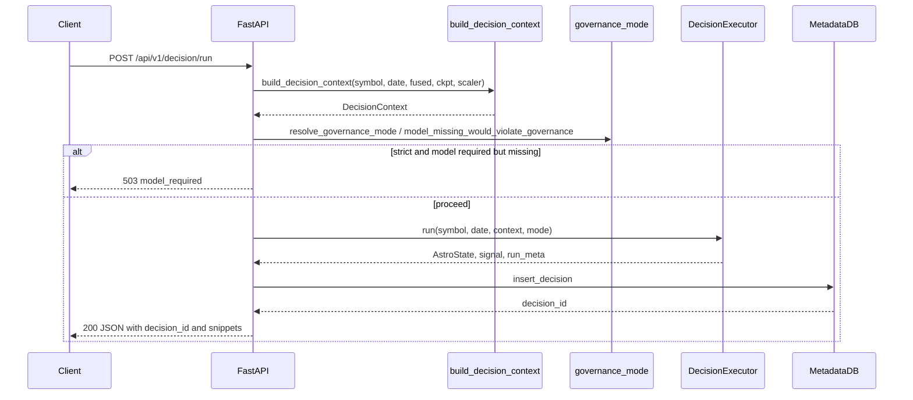
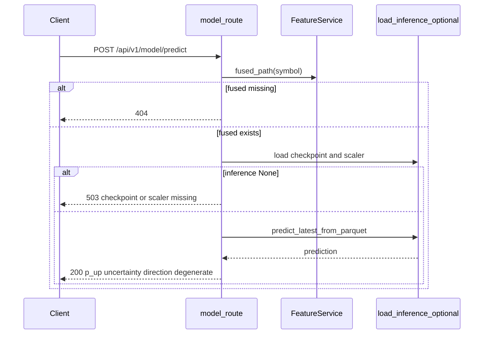
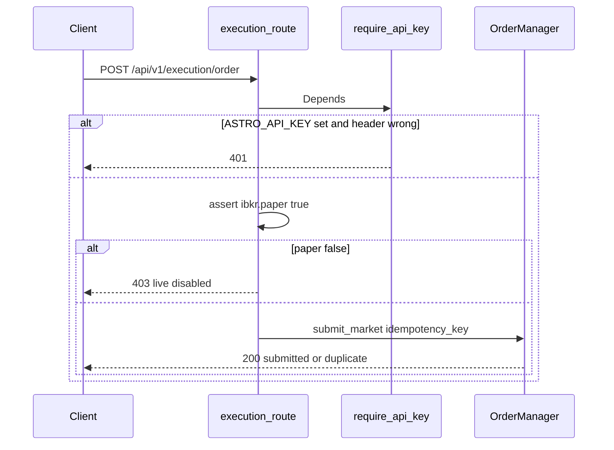

# Sequence diagrams

Diagrams show **happy paths and main branches**. Read the prose under each figure for **why** the messages occur and what operators should monitor.

## Decision run via API

**Narrative:** The client sends a compact JSON body (`symbol`, `trade_date`, optional `mode`). The server must **assemble the same context** a batch script would: load fused Parquet, optionally run inference, attach validation metadata. Only then does it make a **policy decision** about whether calling the executor is legal under **strict governance**. If allowed, the executor performs **multi-stage LLM work**—expensive and sequential—then persists a row for **replay**.

**Branching logic:**

- **503 branch:** `governance_mode == strict` and `model_missing_would_violate_governance` is true → **no** `DecisionExecutor.run` (saves cost and enforces policy).
- **200 branch:** Executor returns final signal + metadata → SQLite `insert_decision` allocates **`decision_id`**.

## Model predict

**Narrative:** This path is intentionally **narrow**: it proves whether **artifacts and columns** suffice for a forward pass. It never invokes analysts. Use it when you want **model-only** health, not a trading narrative.

**Failure ordering:** Missing fused file → **404** before touching GPU/CPU inference. Missing checkpoint/scaler → **503** (different from governance—this is “infra not ready”).

## IBKR order (paper-gated)

**Narrative:** Execution is **deliberately isolated** from the decision route. Even if a decision says BUY, **nothing** hits the broker unless this endpoint is called. The **API key** dependency is optional but, when enabled, protects against unauthenticated order spam on exposed networks.

**Safety gates:** `require_api_key` → **`ibkr.paper` must be true** → `OrderManager` enforces **idempotency** (duplicate keys return `duplicate` without a second broker call).

## Related routes (textual)

- **Replay** (`GET /api/v1/replay`) — Read-only retrieval from SQLite or JSON logs; `recompute=true` returns **501** (not implemented). Use for audit, not live trading loops.
- **Health** (`GET /api/v1/system/health`) — Aggregates **model file readiness** and optional IBKR connectivity; ideal for dashboards.

For data-plane timing without HTTP, see [Data flow](data_flow.md).
