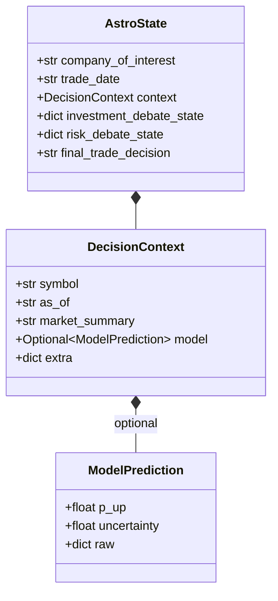
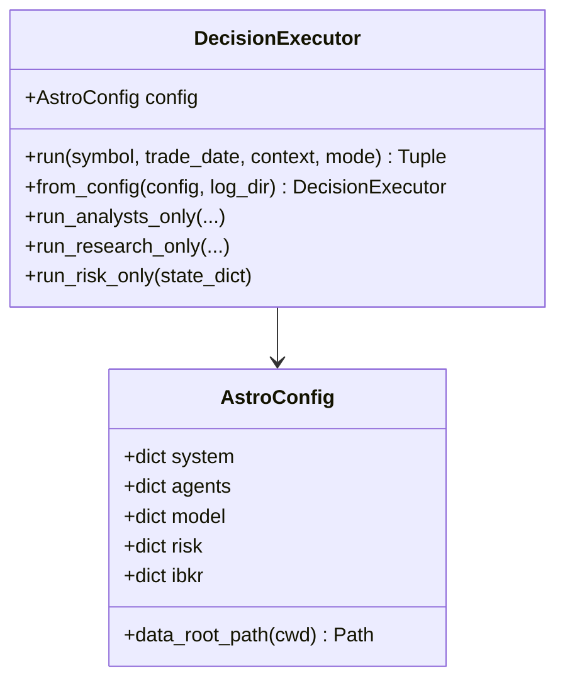
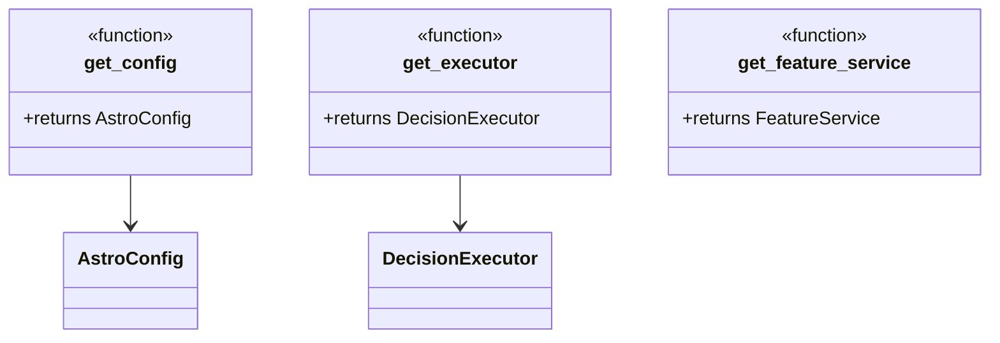
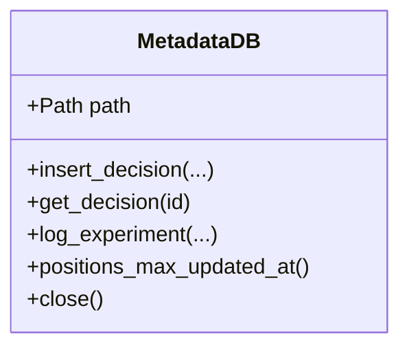

# Class diagrams

Diagrams focus on types that span **decision**, **services**, and **storage**. Agent classes are numerous; see [Modules: agents](../modules/agents.md).

## Decision context and state

## Executor and configuration

## API dependencies (singletons)

## Storage

