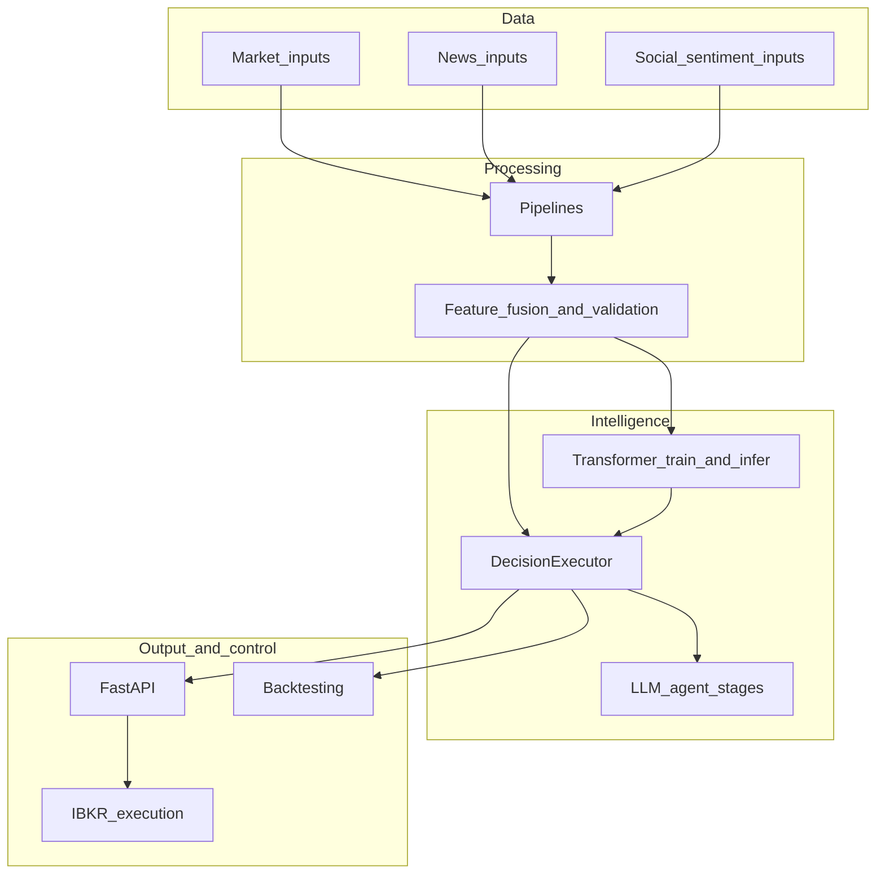

# Astro Trading System

> A modular trading intelligence platform that combines **data pipelines**, **optional transformer inference**, **LLM-based agents**, and a **governed decision engine** behind an optional **FastAPI** control plane. Decisions are **triggered** by API or batch scripts; **broker execution** is a separate, explicit step.

**Package:** `astro-trading` · **Import:** `astro` · **Version:** 0.1.0 (`pyproject.toml`, `astro/__init__.py`)

---

## What is Astro?

Astro is a **layered trading intelligence stack** that bridges:

- **Structured market and feature data** (Parquet, schema-validated)
- **Machine learning** (optional PyTorch transformer: `p_up`, uncertainty)
- **LLM-driven reasoning** (analysts, research debate, trader, risk cycle)

Unlike monolithic notebooks that mix ingestion, prompts, and execution, Astro keeps **pipelines**, **models**, **agents**, and **orchestration** in separate packages. Collaboration happens through well-defined artifacts and types—especially **`DecisionContext`** (built by `build_decision_context` in `astro/services/context_builder.py`) and **`DecisionExecutor`** (`astro/decision_engine/executor.py`), which runs **explicit Python control flow** (not a hidden graph runtime).

At a high level, Astro turns **fused features plus optional model scores** into a **final trade signal** (e.g. BUY / SELL / HOLD semantics via `extract_signal_from_text`) under **configurable governance** (`model_governance` in `agents.yaml`, `apply_model_governance_detailed` in `policy.py`) and **portfolio constraints** (`apply_post_decision_risk`, SQLite positions). Outcomes are **durable**: JSON decision logs (when `log_dir` is set on the executor) and SQLite rows (e.g. `insert_decision` on `POST /api/v1/decision/run`).

---

## What problems Astro solves

### 1. Fragmented trading pipelines

**Problem:** Ingestion, feature code, modeling, and “strategy logic” often live in one script, making changes risky and debugging opaque.

**Astro:** **Ingestion** (`astro/ingestion/`) and **pipelines** (`astro/pipelines/`) produce **versioned Parquet**; **features** (`astro/features/`) enforce **schema contracts** (`schema_registry.json`, `validation.py`). The decision path **reads** those artifacts through **`FeatureService`** and **`build_decision_context`**, not ad-hoc fetches inside LLM tools.

### 2. Limited explainability for ML-only signals

**Problem:** A raw classifier score is hard to defend without narrative context.

**Astro:** **LLM agents** generate **auditable text**: analyst reports, research history, trader plan, risk narrative (`astro/agents/`). The API returns **truncated snippets** and structured fields (e.g. `structured_market_facts`, `analyst_summary`) on `POST /api/v1/decision/run`. **Replay** (`GET /api/v1/replay`) can reload stored decisions or JSON logs—**recompute** is not implemented (**501**).

### 3. Insufficient control over model versus LLM behavior

**Problem:** Teams need policy: when must the model agree, when can the LLM override, when should uncertainty force a deeper path.

**Astro:** **`model_governance`** and **`resolve_governance_mode`** (`astro/decision_engine/governance_mode.py`) support **strict / degraded / dev** modes (YAML + `ASTRO_GOVERNANCE_MODE`). **Strict** can return **HTTP 503** `model_required` on the decision route when a prediction is required but missing. **`DecisionExecutor.run`** can **upgrade fast → full** when model uncertainty exceeds `uncertainty_debate_threshold`, and **skip research debate** when the model is very certain (`policy.py`, `routing.py`).

### 4. Train versus live inconsistency

**Problem:** Different code paths in research and production cause silent skew.

**Astro:** The same **fused Parquet** layout and **`FeatureService`** loading patterns underpin **training**, **inference**, **backtest API**, and **decision context**—provided operators use a **consistent working directory** and resolve **`data_root`** and **`ROOT`** as documented ([System design](architecture/system_design.md)). **Schema validation** runs at multiple boundaries (trainer, inference, backtest route).

---

## Key capabilities

- **Data ingestion** — IBKR-oriented helpers, news/sentiment streams (`astro/ingestion/`); optional **`ib_async`** extra.
- **Pipelines** — Market, news, sentiment, and **fusion** to per-symbol fused Parquet (`astro/pipelines/`).
- **Feature engineering** — Indicators, helpers, **schema registry**, fused-frame validation (`astro/features/`).
- **Transformer model** — Train/infer with uncertainty (`astro/models/transformer/`); optional **`torch`** extra; **ensemble** package is largely stub.
- **Multi-agent reasoning** — Analysts, bull/bear research, trader, three-way risk debate and judge (`astro/agents/`).
- **Decision engine** — `DecisionExecutor` orchestrates stages; policy and portfolio hooks (`astro/decision_engine/`).
- **FastAPI layer** — Health, config, data, model predict, partial agent runs, full decision, backtest, execution, replay, experiments, WebSocket heartbeat (`astro/api/`).
- **Backtesting** — Signal-driven metrics over fused data (`astro/backtesting/`, `POST /api/v1/backtest/run`).
- **Execution layer** — IBKR market orders via `TradeExecutor` and **idempotent** `OrderManager` (`astro/execution/`); **paper-gated** on the API route.

---

## How Astro works (end-to-end flow)

The diagram reflects **logical order** in code: the **executor** invokes **agent stages**; **governance and portfolio** run **after** LLM output inside `DecisionExecutor.run`. **Execution** is **not** automatic after a decision.

### Step-by-step (full decision path)

1. **Trigger** — HTTP `POST /api/v1/decision/run` or a script such as `scripts/run_decision.py`.
2. **Config and paths** — Cached `AstroConfig` (`get_config_cached`), `data_root_path(ROOT)`, checkpoints under project **`ROOT`** (`astro/api/dependencies.py`).
3. **Load fused data** — Resolve `{data_root}/features/{symbol}_fused.parquet`; build summaries and `structured_market_facts`; run **schema validation** into `context.extra`.
4. **Optional model prediction** — `load_inference_optional` + inference on latest window when `best.pt` / `scaler.npz` exist; attach **`ModelPrediction`** or record errors in `extra`.
5. **Governance pre-check (API)** — Under **strict** mode, missing model when required → **503** before LLM spend (`decision.py`).
6. **Executor** — `DecisionExecutor.run`: resolve **fast** vs **full** (and possible fast→full upgrade); run **analysts** → **research** (may be skipped) → **trader** → **risk** (multi-round or fast single judge).
7. **Signal and policy** — `extract_signal_from_text` → `apply_model_governance_detailed` → `apply_post_decision_risk` with SQLite exposure data.
8. **Persist** — API inserts a **decision** row; executor may write **JSON** under `data/cache/decision_logs/` when `log_dir` is configured.
9. **Broker action (optional)** — Only if a client calls **`POST /api/v1/execution/order`** separately (paper, idempotency key, optional `X-API-Key`).

Deeper diagrams: [Data flow](architecture/data_flow.md), [Sequence diagrams](architecture/sequence_diagrams.md). Branching detail: [LLD](design/lld.md).

---

## System architecture overview

**Reading the diagram:** Fused features feed both **inference** and the **executor**. The executor **drives** the LLM stages (`C3`). The API exposes control and reads; **execution** is reachable from the API but **guarded** (`ibkr.paper`, optional API key).

---

## Core components

| Component | Role |
|-----------|------|
| **Ingestion** | Acquire market, news, sentiment inputs; IBKR client and streams (`astro/ingestion/`). |
| **Pipelines** | Deterministic transforms to Parquet; fusion into per-symbol fused files (`astro/pipelines/`). |
| **Features** | Indicators, validation, **schema registry** (`astro/features/`). |
| **Model** | Transformer dataset, trainer, inference helpers (`astro/models/transformer/`). |
| **Agents** | LLM analysts, researchers, trader, risk debators and judge (`astro/agents/`). |
| **Decision engine** | `DecisionExecutor`, policy, routing, workflow, governance mode (`astro/decision_engine/`). |
| **Services** | `FeatureService`, `build_decision_context`, model readiness for health (`astro/services/`). |
| **Storage** | SQLite `MetadataDB` for decisions, orders, positions, experiments (`astro/storage/`). |
| **API** | FastAPI app, routes, schemas, IBKR lifespan (`astro/api/`). |

---

## Decision intelligence (what is distinctive)

Astro is designed as a **decision intelligence** stack, not only a backtester or a chatbot:

- **Hybrid reasoning** — Numeric **model output** (when present) participates in **routing** (fast→full, skip debate) and **governance** alongside LLM-extracted signals.
- **Governed decisions** — Configurable **strict** refusal when the model is required but absent; **degraded** / **dev** modes for non-production use.
- **Dynamic depth** — **Fast** path reduces LLM surface area; **full** path runs research and multi-party risk debate within configured round limits.
- **Traceable outputs** — Rich API response fields plus on-disk **JSON** and **SQLite** for replay and ops.

---

## Who should use Astro

- **Quant and trading systems engineers** — pipelines, risk config, execution paths.
- **ML engineers** — training, inference, schema alignment, evaluation.
- **Algorithmic traders and strategists** — backtests, decision modes, governance tuning.
- **Backend and integration engineers** — HTTP API, OpenAPI, Postman, auth on execution.
- **Operators and SRE** — deployment without bundled Docker, health checks, IBKR connectivity toggles.

---

## Getting started

| Goal | Start here |
|------|------------|
| Install and run locally | [Installation](setup/installation.md) |
| YAML and environment | [Configuration](setup/configuration.md) |
| Production-style deployment | [Deployment](setup/deployment.md) |
| Vision / goals / problem framing | [Overview](overview/vision.md), [Goals](overview/goals.md), [Problem statement](overview/problem_statement.md) |
| HLD and flows | [HLD](architecture/hld.md), [Data flow](architecture/data_flow.md), [System design](architecture/system_design.md) |
| Executor and policy detail | [LLD](design/lld.md) |
| HTTP reference | [API overview](api/overview.md), [Endpoints](api/endpoints.md) |
| Package map | [Module breakdown](design/module_breakdown.md) |

**Interactive OpenAPI** (with the server running): `http://localhost:8000/docs` and `http://localhost:8000/redoc` ([Installation](setup/installation.md)).

**Postman:** `postman/Astro_Trading_API.postman_collection.json`

**Monolithic design note (repo root):** `astro_project.md` — long-form single document; this site splits it for navigation.

---

## Current limitations

- **No Docker or CI** in the repository — deployment is **process-based** (e.g. `uvicorn`); see [Deployment](setup/deployment.md).
- **IBKR** is optional for API startup (`ASTRO_SKIP_IBKR_CONNECT`) but **required** for real broker execution; depends on **`[ibkr]`** and a running Gateway/TWS.
- **Monitoring** (`astro/monitoring/`) and **ensemble** (`astro/models/ensemble/`) are **partial / stub** in the current tree.
- **No HTTP rate limiting** middleware in-repo.
- **Path sensitivity** — Relative `data_root` and checkpoint paths assume a **consistent project root** / `ROOT` resolution; misaligned cwd causes subtle bugs ([System design](architecture/system_design.md)).
- **WebSocket** `/ws/stream` is a **heartbeat** only, not a market data feed.

---

## Future scope

High-level themes (not commitments): **container/CI** for build and deploy, **mkdocstrings**-style API reference, **real monitoring** instead of stubs, **ensemble** implementation, **replay recompute**, richer **WebSocket** payloads, **horizontal scaling** with externalized SQLite, broader **auth** than execution-only API key. See [Future scope](roadmap/future_scope.md) for the maintained list.

---

## Safety reminders

- **`POST /api/v1/decision/run`** may return **503** `model_required` under **strict** governance when a model prediction is required but missing — [Decision](api/endpoints.md#decision).
- **`POST /api/v1/execution/order`** requires **`paper: true`** in `ibkr.yaml` for this build; optional **`ASTRO_API_KEY`** and header **`X-API-Key`**.

---

Astro is intended as a **foundation for governed, extensible trading intelligence**: clear phases, inspectable artifacts, and explicit control over when models, LLMs, and brokers are allowed to act.

Use the **tabs** above to browse Overview, Architecture, Design, API, Modules, Setup, Guides, and Roadmap.
